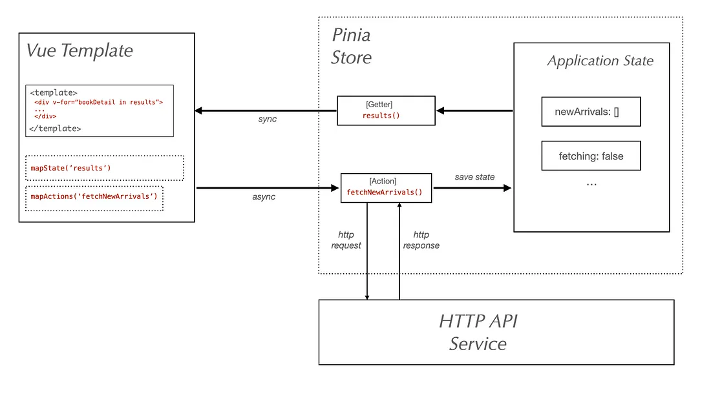

# Vue 3 + Vite

This template should help get you started developing with Vue 3 in Vite. The template uses Vue 3 `<script setup>` SFCs, check out the [script setup docs](https://v3.vuejs.org/api/sfc-script-setup.html#sfc-script-setup) to learn more.

## Recommended IDE Setup

- [VS Code](https://code.visualstudio.com/) + [Volar](https://marketplace.visualstudio.com/items?itemName=Vue.volar) (and disable Vetur) + [TypeScript Vue Plugin (Volar)](https://marketplace.visualstudio.com/items?itemName=Vue.vscode-typescript-vue-plugin).


### Start

Learn How To Create, Test and Deploy a Single Page App With Vue 3 + Vite and Pinia
A complete how-to guide on creating, testing, and deploying an example bookstore application with Vue 3, Vite, Pinia, Nightwatch
Andrei Rusu
Pineview Labs
Andrei Rusu

·
Follow

Published in
Pineview Labs

·
19 min read
·
Feb 8, 2022
137


Introduction
Created in 2014, Vue.js is undoubtedly one of the leading frontend frameworks at the moment, and with a growing community and expanding ecosystem it seems that its position is firm for quite some time. I have worked with Vue 2 several years ago for a few projects and I found it a delightful experience.

I thought now it’s time to upgrade my tool-set with the latest version and also with newer tools.

This guide will cover in detail the steps to create a functional example bookstore single-page application using Vue 3 and run it using Vite. It also includes details on how to add state management using Pinia (the Vuex successor) and routing using Vue Router.

The core concepts that will be covered are:

creating a Vue 3 single page application using Vite
managing routes with Vue Router
managing application state with Pinia
running, building and deploying the app with Vite
writing and running Vue component tests
writing and running automated end-to-end tests with Nightwatch.js
This may seem like a lot but I think it’s perfectly possible to go through all of it in less than 20 minutes. Some of the topics listed above could be expanded into entire tutorials of their own, but for now I am covering only what’s needed to have everything up and running.

One last thing that needs to be mentioned is that the backend is not covered in this tutorial. There is no server-side component per se, although the data is loaded using the browser Fetch API (the successor of XHR) so a backend component could be easily added.

For all accounts and purposes, the application we’ll build here can be deployed as a static website. If you’re eager to get right down to coding and you’d like to jump into it right away, you can just get the project up and running with:

Or fork the project on Github at: https://github.com/beatfactor/middlemarch


Step 1 — Setting Up the Application with the create-vite Scaffolding Tool
We’re going to use the official create-vite scaffolding tool to setup the project structure so make sure you have Node 12+ installed with NPM 6+. They also support Yarn and PNPM as package managers, but we'll only cover NPM.

The create-vite tool will also create the project folder for you, so just make sure to cd into the parent folder first:

cd /workspace
Install Vite and initialise the project with:

$ npm init vite@latest

Then you’ll be prompted to enter the project name and select the library which you want to use. From the list, choose vue:

~/workspace % npm init vite@latest
npx: installed 6 in 1.051s
✔ Project name: … vue-bookstore
? Select a framework: › - Use arrow-keys. Return to submit.
    vanilla
❯   vue
    react
    preact
    lit
    svelte
Then select vue as the variant, since we’ll not be using TypeScript:

? Select a variant: › - Use arrow-keys. Return to submit.
❯   vue
    vue-ts
You should see the following output:

npx: installed 6 in 1.051s
✔ Project name: … vue-bookstore
✔ Select a framework: › vue
✔ Select a variant: › vue
Scaffolding project in /Users/andrei/workspace/vue-bookstore...
Done. Now run:
cd vue-bookstore
  npm install
  npm run dev
Once we have followed the above instructions, we’ll get the following output from Vite telling us that the app is running:

vite v2.7.7 dev server running at:
> Local: http://localhost:3000/
  > Network: use `--host` to expose
ready in 611ms.
Let’s visit the localhost:3000 url. The welcome page looks like this:


img:


Step 2 — Adding routing with Vue Router and state management with Pinia
Let’s review the project’s directory structure created by the create-vitetool:

vue-bookstore/
 ├── public/
 |    ├── favicon.ico
 ├── src/
 |    ├── assets/
 |    |    └── logo.png
 |    ├── components/
 |    |    └── HelloWorld.vue
 |    ├── App.vue
 |    └── main.js
 ├─── package.json
 ├─── README.md
 └─── vite.config.js
In this section of our guide, we’ll be adding two new dependencies to our project: vue-router and pinia. Let’s go ahead and install them from NPM.

Vue Router
vue-router is the official router for Vue.js. We'll need to install version 4 which is compatible with Vue 3:

$ npm install vue-router@4 --save
Pinia
Pinia is one of the newest projects to emerge from the Vue ecosystem and it’s the new official state management tool for Vue.js apps. It’s api is very similar to Vuex (its predecessor) and it is designed to be faster and more lightweight.

You can install pinia from NPM with:

$ npm install pinia --save

Setting Up Routing
If you’re unfamiliar with routing in a single page application or state management, don’t worry; both of these concepts are very easy to understand and they will be self explained once you see how it works.

Also, remember that we are just building a tutorial here and the goal is to have everything up and running in 20 minutes and that doesn’t require learning all there is to know about Vue.js. It doesn’t even require understanding everything we’ll be doing.

What is a Single Page Application?
Since we’re building a single page application here, it might be useful (though not essential) to consider what that means and why is it single page.

A single page application is simply a web application that doesn’t reload the page when you navigate to another of its sub-pages. The url of the browser is modified though, as if the page has been reloaded, and that’s done using the HTML5 History API .

Working with Vue Components in Vite
The scaffolding created using the create-vite tool adds a very basic Vue component, located in src/components/HelloWorld.vue. It is then being used in the main application component, located in src/App.vue.

There are two other important files:

index.html
src/main.js
The index.html file is what the browser sees when it navigates to our application’s page and the main.js is the entry point for the Vue.js app.

Here’s how these files look like:

index.html:

<!DOCTYPE html>
<html lang="en">
  <head>
    <meta charset="UTF-8" />
    <link rel="icon" href="/favicon.ico" />
    <meta name="viewport" content="width=device-width, initial-scale=1.0" />
    <title>Vite App</title>
  </head>
  <body>
    <div id="app"></div>
    <script type="module" src="/src/main.js"></script>
  </body>
</html>
src/main.js:

import { createApp } from 'vue'
import App from './App.vue'
createApp(App).mount('#app')
Adding Routes
It’s time now to create our application’s main routes. In Vue, every route must correspond to a component. For this application, we’ll consider a component per subpage, like so:

Homepage — our bookstore homepage
Cart — the shopping cart and check out page
Sign-In — the user sign-in page
Since this is only an example, other pages like user sign-up or product detail page, have been left out. Also, the sign-in page is only contains only a mock sign-in.

For basic HTML and CSS, I’ve also used Bootstrap 5 for things like UI dropdowns and forms, but of course you can use whatever UI library you want.

We’ll create the page components empty for now so we can setup the routing. The new src directory structure will look like this (after removing the boilerplate code):

```

src/
  ├── components/
  |    └── TopNavbar.js
  ├── lib/
  |    ├── router.js   
  |    └── store.js
  ├── pages/
  |    ├── cart/
  |    |    ├── cart.css
  |    |    ├── cart.html
  |    |    └── Cart.vue
  |    ├── home/
  |    |    ├── home.css
  |    |    ├── home.html
  |    |    └── Home.vue
  |    ├── sign-in/
  |    |    ├── sign-in.css
  |    |    ├── sign-in.html
  |    |    └── SignIn.vue
  |    └── routes.js
  ├── App.vue
  └── main.js

```

We’ve added three pages, each of which we’ll keep very basic. We’ll just add TobNavbar component to make the navigation working without page reloads.

```

Add the following for src/pages/cart/Cart.vue, src/pages/home/Home.vue and src/pages/sign-in/SignIn.vue:
`

<script setup>
import TopNavbar from '../../components/TopNavbar.vue';
</script>
<template>
  <TopNavbar />
</template>
<style></style>
<script>
export default {
  components: {
    TopNavbar
  },
computed: {},
  
  mounted() {
  },
  
  data() {
    return {
    };
  },
};
</script>

`

The TopNavbar component located in src/components will contain just the navigation links. Notice the router-link component which is part of the vue-router:

```
<template>
  <router-link to="/">Home</router-link>
  <router-link to="/cart/">Cart</router-link>
  <router-link to="/sign-in/">Sign In</router-link>
</template>
The pages/routes.js file contains all the route declarations for the application. Here’s how it looks like:

import {createRouter} from 'vue-router'
import Homepage from './home/Home.vue';
import SignIn from './sign-in/SignIn.vue';
import Cart from './cart/Cart.vue';
const routes = [
  {
    path: '/',
    component: Homepage
  },
{
    path: '/sign-in/',
    component: SignIn
  },
{
    path: '/cart/',
    component: Cart
  },
]
export default function (history) {
  return createRouter({
    history,
    routes
  })
}
Before we’re ready to see the vue-router in action we just need to do 2 more things:

1) Create the router and add it to the main Vue application instance, in src/main.js:

import { createApp } from 'vue'
import { createWebHistory } from 'vue-router'
import createRouter from './pages/routes.js'
import App from './App.vue'
const router = createRouter(createWebHistory())
const app = createApp(App)
app.use(router).mount('#app')
2) Add the <router-view> component in src/App.vue:

<template>
  <router-view></router-view>
</template>
Now re-run npm run dev if needed and then navigate to http://localhost:3000 and you’ll have a routing enabled Vue 3 app.

```

Setting Up State Management Using Pinia
Moving on, now we need to set up the Pinia store for our app. The store is where the application state is maintained.

Pinia is a new project from the Vue.js core team and is now the recommended approach for working with the application state. If you’re already familiar with Vuex, getting used to Pinia will be straightforward. In fact, the Pinia api is slightly easier and less verbose than Vuex.

With Pinia, in a Vue 3 app there is one root store and then any number of individual stores. For our bookstore app, we’re going to use only two stores:

the catalog store: a list of available books
the cart store: books that the user wants to order
Creating a Pinia
A “pinia” is the root store that we have to create first and pass it to the Vue instance.

We’ll do that in src/main.js and update it to look like:

import { createApp } from 'vue'
import { createWebHistory } from 'vue-router'
import { createPinia } from 'pinia'
import createRouter from './pages/routes.js'
import App from './App.vue'
const store = createPinia()
const router = createRouter(createWebHistory())
const app = createApp(App)
app.use(router).use(store).mount('#app')
Next step is to create the individual catalog and cart stores and use them in components.

Adding the Catalog Store
Creating a Pinia store means two things mainly:

Defining the store
Using the store in one or more components
Defining the Store
Like Vuex, the Pinia store contains the state and two types of methods: getters and actions.

Some things to consider about a store:

Getters are synchronous functions used to retrieve data from the state
Actions are functions that can also be asynchronous which are used to update the state
The state is defined as a function returning the initial state
It’s time now to create the catalog store inside src/stores/catalog.js:

import { defineStore } from 'pinia'
export const useCatalog = defineStore('catalog-store', {
  state: () => {
    return {
      newArrivals: [],
      fetching: false
    }
  },
getters: {
    results(state) {
      return state.newArrivals;
    },
isFetching(state) {
      return state.fetching;
    }
  },
actions: {
    async fetchNewArrivals() {
      this.fetching = true;
      const response = await fetch('/data/new-arrivals.json');
      try {
        const result = await response.json();
        this.newArrivals = result.books;
      } catch (err) {
        this.newArrivals = [];
        console.error('Error loading new arrivals:', err);
        return err;
      }
this.fetching = false;
    }
  }
})
Looking at the above source code, you’ll notice we have two getters (results and isFetching) and one action (fetchNewArrivals). Instead of a real backend we just have a json file located in /data/new-arrivals.json which contains a few books that we’ll use as our catalog.

You’ll also notice that our getters don’t do anything special with the data and so they’re a bit unnecessary, but I thought it’s still good to show how you can define them.

Using the Store in a Template
Linking the above definition to a template is also quite straightforward.

Let’s create a new component called NewArrivals inside src/components/NewArrivals.vue which we’ll use it the Home.vue page component.

<script setup>
import {useCatalog} from '../../store/catalog.js'
</script>
<template>
</template>
<style scoped></style>
<script>
import { mapState, mapActions } from 'pinia'
export default {
  computed: {
    ...mapState(useCatalog, {newArrivals: 'results'})
  },
methods: {
    ...mapActions(useCatalog, ['fetchNewArrivals']),
addToCart() {
      // we'll populate this later
    }
  },
created() {
    // when the template is created, we call this action
    this.fetchNewArrivals();
  }
};
</script>
And the Home.vue component becomes:

<script setup>
import TopNavbar from '../../components/TopNavbar.vue';
import NewArrivals from '../../components/NewArrivals.vue';
</script>
<template>
  <TopNavbar />
  <NewArrivals />
</template>
<style></style>
<script>
export default {
  components: {
    TopNavbar,
    NewArrivals
  },
  computed: {},
  mounted() {},
  data() {
    return {};
  },
};
</script>
Here’s a diagram of how the store and the component work together in the application:



I also wrote a store and a component for the cart but I will not include it in the tutorial because the mechanism is similar and you can inspect the source code in the repository which has everything added together, even some styles.


Step 3 — Testing Vue.js Components
Component testing is a type of UI testing where the component is rendered in isolation, without the rest of app components, for the purpose of verifying its functionality. It’s usually a testing strategy which happens prior the end-to-end testing step, which we’ll elaborate in the next section.

We need to install the Vue TestUtils project, which is the official unit testing library for Vue.js and we need the one that targets Vue 3. You can install that from NPM with:

npm install @vue/test-utils@next --save-dev
Installing Nightwatch.js and ChromeDriver
We’ll use Nightwatch.js for both component testing and end-to-end testing. Nightwatch is already one of the recommended testing frameworks by the Vue.js team and was published around the same time as Vue.

It has recently gotten support for Vue component testing through the vite-plugin-nightwatch. We’ll go ahead an install Nightwatch (version 2.0):

npm install nightwatch --save-dev
And we’ll also need the vite-plugin-nightwatch mentioned earlier:

npm install vite-plugin-nightwatch --save-dev
Nightwatch uses the W3C WebDriver API for browser automation tasks and we’ll need to install the chromedriver NPM package as well, because we’re going to use Chrome to run our tests.

npm install chromedriver --save-dev
Testing the <NewArrivals> Component
The vite-plugin-nightwatch includes a test renderer page and Nightwatch already contains everything needed for running the initial test for our component.

Create a folder test and inside it two subfolders:

component - this will hold component tests
e2e - this will hold end-to-end tests
We also need a nightwatch.conf.js configuration file, but we can run Nightwatch directly and the config file will be created for us automatically. Just make sure chromedriver is also installed (and the Chrome browser, of course).

Make sure the current working directory is the project root and then simply run an example test which are bundled with Nightwatch. We’ll pick the duckDuckGo test because it’s the fastest:

$ npx nightwatch examples/tests/duckDuckGo.js
The project structure should look like this now:

vue-bookstore/
 ├── public/
 |    ├── data/
 |    └── favicon.ico
 ├── src/
 ├── ...
 |    └── main.js
 ├── test/
 |    ├── component/
 |    └── e2e/
 ├─── nightwatch.conf.js
 ├─── package.json
 ├─── README.md
 └─── vite.config.js
We’ll go ahead and create a new file called newArrivalsTest.js inside test/component. In it, we’ll just add a basic test which mounts the component and checks if the returned element can be found in the page (i.e. the component has been mounted).

describe('New Arrivals Component Test', function() {
it('checks if the component has been mounted', async (browser) => {
    const component = await browser.mountVueComponent('/src/components/new-arrivals/NewArrivals.vue', {
      plugins: {
        router: '/src/lib/router.js'
      }
 });
    
    expect(component).to.be.present; 
  });
});
Nightwatch uses the same describe() syntax as Mocha. You can even use Mocha as a test runner if you’re already familiar with it, but we’re not going to do that for now.

It’s time now to run the above test and for that we’ll run Nightwatch using Chrome, like so:

npx nightwatch test/component/newArrivalsTest.js --env chrome
This will open the Chrome browser and render the component, then perform the test. If you don’t like seeing the browser window pop up during the test, you can pass the --headless argument, like so:

npx nightwatch test/component/newArrivalsTest.js --env chrome --headless
The test output should look like below:

[New Arrivals Component Test] Test Suite
──────────────────────────────────────────────────────────────
ℹ Connected to ChromeDriver on port 9515 (652ms).
  Using: chrome (97.0.4692.99) on MAC OS X.
Running tests the component:
──────────────────────────────────────────────────────────────
  ✔ Expected element <web element{e53f9b1e-11d3-4dc4-8728-4d3cd077343e}> to be present (1ms)
OK. 1 assertions passed. (781ms)
You can of course consult all the CLI options that the Nightwatch runner provides, either by going to the docs pages or by running:

npx nightwatch --help
Extending the <NewArrivals> Test
You may have noticed that our component test isn’t testing that much which means that the test is not as helpful as it could be. So we’ll go ahead and extend it only a little bit.

We’ll just inspect the NewArrivals component and check if there is a property in it called newArrivals, which is used in the html to render the results.

The test looks like this now. We’ve refactored the component mounting into the the before hook so we can only do the checks inside the test, which is the it block. The expect library is provided by Nightwatch out of the box and it is based on the popular and versatile Chai.js assertion library. More info on how to use the expect on the Nightwatch docs website.

describe('New Arrivals Component Test', function() {
let component;
before(async () => {
    component = await browser.mountVueComponent('/src/components/new-arrivals/NewArrivals.vue', {
      plugins: {
        router: '/src/lib/router.js'
      }
 })
  });
it('checks if the component has been mounted', function(browser) {
    expect(component).to.be.present;
    expect(component).to.have.property('newArrivals');
 expect(component).text.toContain('The Memory Police')
expect.elements('div.col-md-6').count.toEqual(4);       expect(component.property('newArrivals')).to.be.an('array').with.length(1);   
  });
});
Step 4 — Adding End-to-End Testing
We are nearly at the end of this tutorial and before we can consider we have a working Vue.js app, we need to add support for end-to-end testing and setup a CI pipeline on Github Actions.

Fortunately we don’t need to install, nor configure, any other tools, unless maybe some fancy reporters, but for now we can get everything we need in terms of end-to-end automated testing out of Nightwatch. Besides Chrome, Nightwatch has built-in support for all major browsers, including Firefox, Edge, and Safari, all thanks to its integration with the W3C Webdriver API and Selenium. It also allows you to use distributed cloud testing platforms like BrowserStack, SauceLabs, CrossBrowserTesting, or LambdaTest.

For now, we’ll just keep things less complex and we’ll only focus on writing a few basic automated tests and run them in Chrome, Firefox, and Safari.

Writing the Homepage End-to-End Test
Let’s get started with the homepage end-to-end test and create a new file under test/e2e/homePageTest.js. The syntax is the same as for the component test, but for running the end-to-end tests we’ll use the compiled build of our application.

We can of course run them against the dev build, but the established practice in software development, as far as I can tell, is to run the end-to-end tests in an environment that simulates the production as close as possible. This is why they’re called end-to-end tests I suppose, to run them against the end product.

Running the Production Build
To run the production build we have two options and each of them involves running a Vite command, which is wrapped in an NPM task.

npm run build - this will generate the index.html and the other static assets. You can use this option if you already have a local web server set up.
npm run preview - this will generate a production build and run it using the built-in dev server, by default at http://localhost:5000.
The second option is clearly more straightforward and so let’s just run the preview command and see what happens:

$ npm run preview
> vue-bookstore@0.0.0 preview /Users/andrei/workspace/vue-bookstore
> vite preview
> Local: http://localhost:5000/
  > Network: use `--host` to expose
Writing the Test Script
Now that we have a production-ready build running, we can start writing the actual test in test/e2e/homePageTest.js. We’ll start small, with just the below:

describe('Homepage End-to-end Test', () => {
it('tests if homepage is loaded', browser => {
    browser
      .navigateTo('http://localhost:3000')
      .assert.visible('#app .new-arrivals-panel')
      .expect.elements('#app .new-arrivals-panel .col-md-6').count.toEqual(4)
  });
it('adds 2 volumes of "Rhinoceros and Other Plays" to cart', browser => {
    browser
      .click('.new-arrivals-panel .col-md-6:nth-child(2) button.add-to-cart')
      .click('.new-arrivals-panel .col-md-6:nth-child(2) button.add-to-cart')
      .assert.textEquals('.shopping-cart .badge', '2');
  });
after(browser => browser.end());
});
The test verifies if the New Arrivals panel is displayed in the page and that it contains all 4 entries which we’ve already seen.

Running the Test Script in Chrome
To run this in Chrome, the command is very similar to the one for the component test:

npx nightwatch test/e2e/homePageTest.js --env chrome
And the output will be:

[Homepage End-to-end Test] Test Suite
──────────────────────────────────────────────────────────────
ℹ Connected to ChromeDriver on port 9515 (2454ms).
  Using: chrome (97.0.4692.99) on MAC OS X.
Running tests the homepage:
──────────────────────────────────────────────────────────────
  ✔ Testing if element <#app .new-arrivals-panel> is visible (157ms)
  ✔ Expected elements <#app .new-arrivals-panel .col-md-6> count to equal: "4" (18ms)
OK. 2 assertions passed. (765ms)
Running the Test Script in Firefox
If we’d want to also run our end-to-end tests in the Firefox browser, we only need to install the GeckoDriver (the Firefox specific implementation of the W3C WebDriver API). No other config is necessary to get it working unless you are like to customize it further.

So let’s go ahead and install it from NPM:

npm i geckodriver --save-dev
And then run Nightwatch with the following command:

npx nightwatch test/e2e/homePageTest.js --env firefox
And the output:

[Homepage End-to-end Test] Test Suite
──────────────────────────────────────────────────────────────
ℹ Connected to GeckoDriver on port 4444 (1737ms).
  Using: firefox (96.0.2) on MAC (20.6.0).
Running tests the homepage:
──────────────────────────────────────────────────────────────
  ✔ Testing if element <#app .new-arrivals-panel> is visible (54ms)
  ✔ Expected elements <#app .new-arrivals-panel .col-md-6> count to equal: "4" (6ms)
OK. 2 assertions passed. (612ms)
Running the Test Script in Safari
If you’re using a Mac, then safaridriver is probably already installed, depending on your Safari version.

You can check with using:

safaridriver --help
And the output should look like:

Usage: safaridriver [options]
	-h, --help                Prints out this usage information.
	--version                 Prints out version information and exits.
	-p, --port                Port number the driver should use. If the server is already running, the port cannot be changed. If port 0 is specified, a default port will be used.
	--enable                  Applies configuration changes so that subsequent WebDriver                           sessions will run without further authentication.
	--diagnose                Causes safaridriver to log diagnostic information for all sessions hosted by this instance. See the safaridriver(1) man page for more details about diagnostic logging.
Before running your first test in Safari, you just need to enable automation, with the following command:

safaridriver --enable
And then simply run the Nightwatch test with:

npx nightwatch test/e2e/homePageTest.js --env safari
Running In Parallel in Multiple Browsers
If you need to run your Nightwatch tests (either component or end-to-end) in more than one browser, you can also do so in more then one browser in parallel.

Simply pass the browsers as a comma separated list (no spaces):

Running in Firefox+Chrome
npx nightwatch test/e2e/homePageTest.js --env firefox,chrome
Running in Firefox+Chrome+Safari
npx nightwatch test/e2e/homePageTest.js --env firefox,chrome,safari
Nightwatch also supports running tests in parallel by dividing the total number of test script files over a configurable number of workers. But since we only have one file for now, we’ll skip this part. More on parallelism on the Nightwatch docs website.

Step 5 — Enabling Continuous Integration with Github Actions
It looks like it’s time to wrap things up and put everything together. Before we can enable continuous deployment in Github Actions, we need to create the test NPM task.

Creating the “npm test” Task
Now we have both component testing and end-to-end testing in our example project. Of course, it is only at a minimum level so it doesn’t cover everything, but it’s a good start I would say.

The easiest way to tell Nightwatch to run all the tests inside the test folder is to pass the folder as the second CLI argument. We’ll add that as a new NPM task called test so let’s edit the package.json and add the following, inside the “scripts” dictionary:

"test": "nightwatch ./test"
We can run the NPM task and pass Nightwatch related CLI arguments like so:

npm test -- --env chrome --headless
We’ll use --headless mode in order to run the tests in Github Actions.

Adding the Github Actions Workflow
Finally, we can add the Github Actions workflow so that our tests can run on every push and every pull request.

Doing so it’s quite straightforward. We’ll use the Node.js template and add a few new steps in the list, for:

starting the dev server in background
building the project and starting the dev server in preview mode, also in background
running both component and end-to-end tests in Chrome, in headless mode
Creating the Github Actions workflow means to add a new file called node.js.yml in the .github/workflows folder which should look like below. Most of this is auto-generated when you navigate to the Actions section from your Github project and choose the Node.js template.

name: Node.js CI
on:
  push:
    branches: [ main ]
  pull_request:
    branches: [ main ]
jobs:
  build:
    runs-on: ubuntu-latest
    strategy:
      matrix:
        node-version: [12.x, 14.x]
    steps:
      - uses: actions/checkout@v2
      - name: Use Node.js ${{ matrix.node-version }}
        uses: actions/setup-node@v2
        with:
          node-version: ${{ matrix.node-version }}
      - run: npm ci
      - name: Start vite dev server
        run: npm run dev &
      - name: Build the app
        run: npm run build
        
      - name: Start vite dev server in preview
        run: npm run preview &
        
      - name: Run Nightwatch tests
        run: npm test
And that’s it. A new build will run for each new git push or whenever a new pull request is sent. The build will be ran in 2 separate environments, one for Node 12 and the other Node 14, as defined in the workflow definition.

Where to Go From Here
The project is available on Github at https://github.com/beatfactor/middlemarch with all the code covered here and a bit more styling and imagery.

It also contains the code for the shopping cart and a mock checkout page.


You can get it running on your local machine with the usual steps:

git clone https://github.com/beatfactor/middlemarch
npm install
npm run dev
Feel free to send pull requests or report issues.

Getting Support
Vue3, Vite, and Pinia
The Vue.js core team provides community support for Vue3, Vite, and Pinia on the following channels:

VueLand chat server on Discord
Vue Forum
Vite Discussions on Github
Pinia Discussions on Github
Nightwatch.js
For support with everything Nightwatch testing related, we have the following channels:

Github Discussions
Nightwatch.js chat server on Discord
Want to Connect?
Andrei Rusu is an independent open-source software engineer based in Oslo, Norway and author of the Nightwatch.js testing framework. Currently he works with BrowserStack, as part of their Open-Source Program Office.
Originally published at https://labs.pineview.io.

